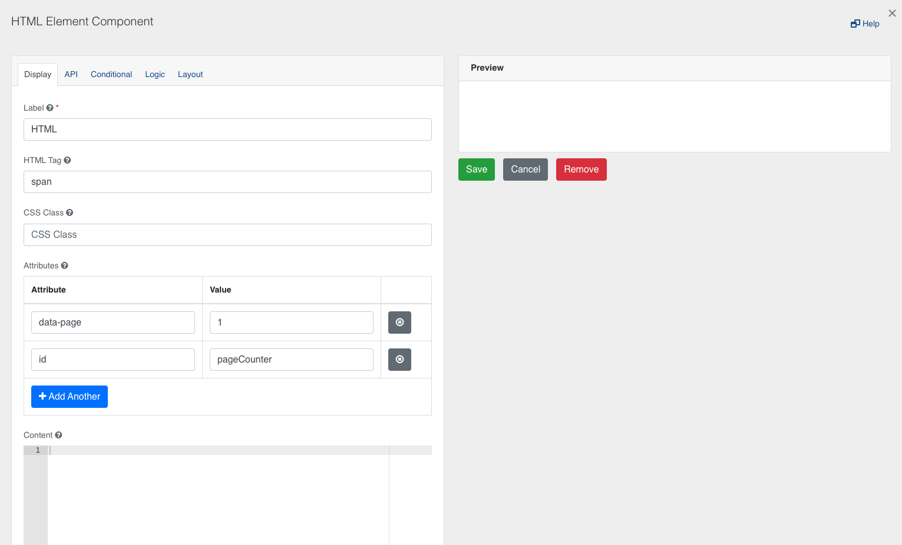
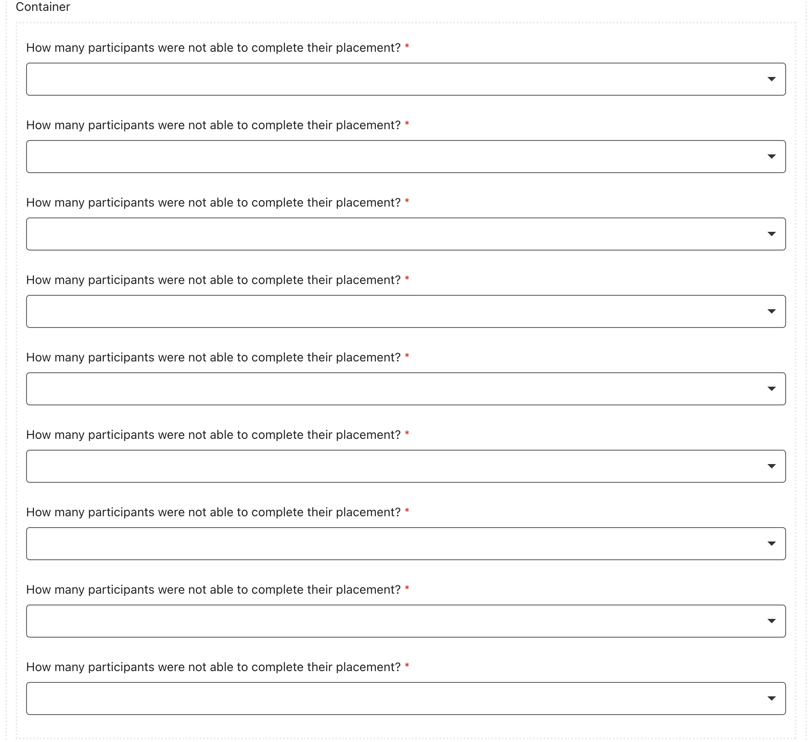
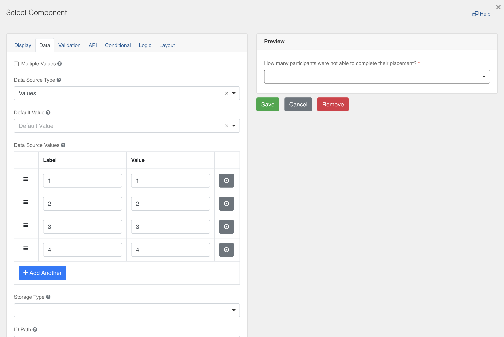
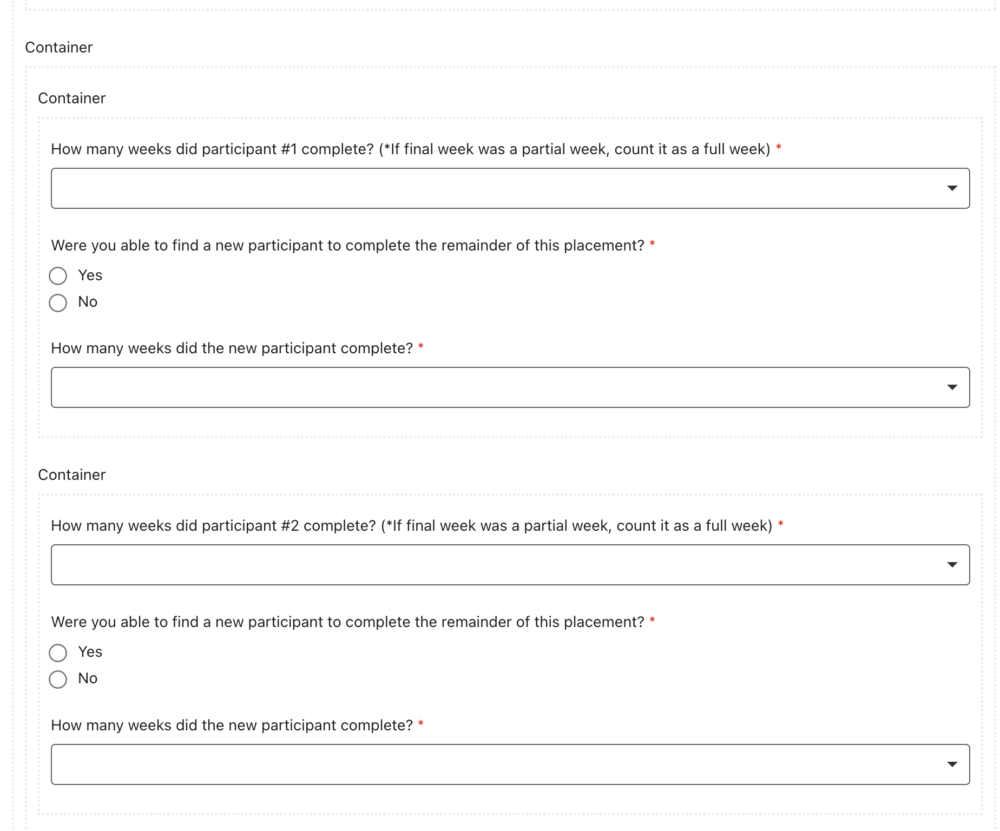

# Creation Instructions for WEOG Report 2022 In Chefs

Application ID:

To selectively allow and disallow editing of the Application ID two separate fields were made. 1 HTML Content Component, 1 Text Field Component. The first condition below allows the uneditable HTML Content Component to display the prefilled Application ID by reading the url and parsing the id parameter out.

show = (window.location.href.split("&id=").length > 1);

This second condition is used to display the text field when a application ID is not given by checking if the id parameter is given in the url.

show = (window.location.href.split("&id=").length < 2);

Displaying Fields Independently:

Create an empty HTML element component with any html tag. In the attributes section I include 2 attributes data-page which is the counter and id which allows other fields to find this field. Read-only logic is also used on the HTML element the trigger for the logic is:

result = instance.options.readOnly;

the action to for the logic is:

document.getElementById("pageCounter").dataset.page = 9;

The logic is for when the form is completed allowing for full navigation of the form. The data-page attribute allows us to store a variable in an HTML element which we use for the current page count, which is set to the max when in read-only mode.

Double next buttons:

Each page has two separate next/submit buttons. One button its shown when there are still questions that need to be answered, this button does not move the user forward and just highlights unanswered questions. The other button shows when all required questions on the page are answered and moves the user forward.

The first button does not have an action when clicked which highlights questions left when show validations checkbox is true. The button to move forward uses the following action to move forward and update the counter in the html element.

document.getElementById("pageCounter").dataset.page = 2;
var tabs = form.getComponent('part1')
tabs.setTab(1)

To show and hide the buttons I use the following condition:

var list = utils.searchComponents(instance.parent.parent.components, {'component.validate.required': true, '_visible': true});
var temp = false;
for (i = 0; i< list.length; i++){
  if(list[i].dataValue === ""){
    temp = true;
  }
}
show = temp;

This condition is used on the highlighting button, the moving button has the same condition with the temp variable starting as true and being set to false.

How many participants were not able to complete their placements?:

Form.io does not have the ability for designers to dynamically change drop down options based on prior question answers. So I created multiple dropdowns with different options and gave them different conditions based on how many participants did the option.

How many weeks did each participant complete?:

I nested multiple containers to allow showing multiple questions independently. In the inner containers advanced conditions were used to increase the amount of questions regarding incomplete placements depending on the incomplete placements.

Were you able to find a replacement?:

This question is only supposed to appear if the first participant did not complete more than 8 weeks. A switch case condition is used to determine whether they completed long enough to require a replacement. This is used to make an exclusive or condition so when the answer is not selected it will not display the question.

Forcing participant totals to match:

To keep the total participants correct across the 10 and 20 week placements I put a custom validation in the how many participants did each option. THe following validation checks the data to see whether the total of both the 20 and 10 week equal the total originally given.

valid = (data.page1.howManyParticipantsStartedTheirPlacement == data.page2.howManyParticipantsDidOption112WeekPlacement + data.page3.howManyParticipantsDidOption2) ? true : 'The number of participants declared in the 12 week and/or 20 week options does not match the total number of participants declared';

